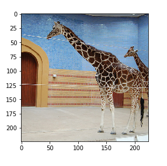
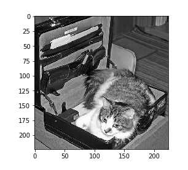
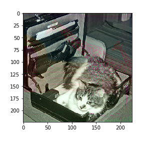
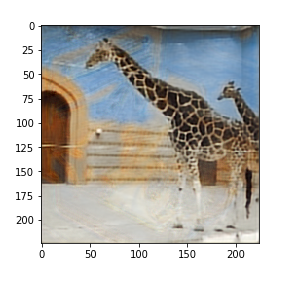

# Data-Hiding-with-Deep-Network : Steganography

This is for hiding a image inside another using neural network and it can be visualised as 

Secret image + cover image = Covered image and from it one can reveal secret image.

